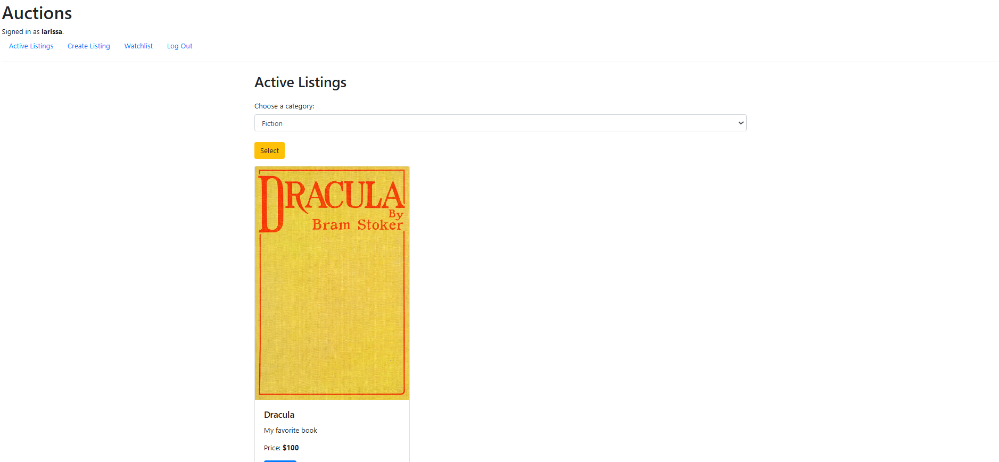

# Commerce


# Projeto de Leilão

Este projeto é uma aplicação de leilão desenvolvida em Django, permitindo que os usuários criem listagens, façam lances, comentem e gerenciem suas listagens em uma lista de observação.

## Funcionalidades

- **Registro e Login de Usuário**: Os usuários podem se registrar e fazer login.
- **Criação de Listagens**: Usuários autenticados podem criar novas listagens de leilão.
- **Lances**: Os usuários podem fazer lances em listagens ativas.
- **Comentários**: Os usuários podem deixar comentários nas listagens.
- **Lista de Observação**: Os usuários podem adicionar ou remover listagens de sua lista de observação.
- **Filtragem por Categoria**: Os usuários podem visualizar listagens filtradas por categoria.

## Modelos

### User
- Extensão do modelo `AbstractUser` do Django.

### Category
- `categoryName`: Nome da categoria (CharField).

### Bid
- `bid`: Valor do lance (IntegerField).
- `user`: Relacionamento com o usuário que fez o lance (ForeignKey).

### Listing
- `title`: Título da listagem (CharField).
- `description`: Descrição da listagem (CharField).
- `imageUrl`: URL da imagem da listagem (CharField).
- `price`: Relacionamento com o lance (ForeignKey).
- `isActive`: Indica se a listagem está ativa (BooleanField).
- `owner`: Relacionamento com o usuário que criou a listagem (ForeignKey).
- `category`: Relacionamento com a categoria da listagem (ForeignKey).
- `watchlist`: Lista de usuários que estão observando a listagem (ManyToManyField).

### Comment
- `author`: Relacionamento com o usuário que fez o comentário (ForeignKey).
- `listing`: Relacionamento com a listagem comentada (ForeignKey).
- `message`: Mensagem do comentário (CharField).

## Testes

O projeto inclui testes para garantir que os modelos funcionem conforme o esperado. Os testes cobrem a criação de usuários, categorias, lances, listagens e comentários.

### Executando os Testes

Para executar os testes, use o seguinte comando:

```bash
python manage.py test
```
Instale as dependências:
```bash
pip install requirement.txt
```

Aplique as migrações:
```bash
python manage.py makemigrations
python manage.py migrate
```
Crie um superusuário (opcional, para acessar o painel de administração):
```bash
python manage.py createsuperuser
```
```bash
python manage.py runserver
```
